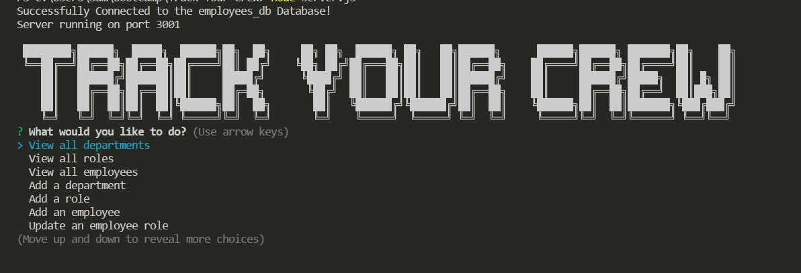

# TRACK YOUR CREW

## Description 
  
In this Node.js application the user will be able to track their employees.  Start up the application and choose the choices to start your task needed to be perform.  Whether its viewing information regarding the departments, employees or their roles, to updating these information select the choices prompted to you to get started.

## Table of Contents 
  
- [Installation](#installation)
- [Usage](#usage)
- [Credits](#credits)

## Installation

Some installation packages is needed to run this application in command-line.

Please be sure to have the following installed prior to running this application:

-Install node version v16.18.0 by following instructions here:

https://coding-boot-camp.github.io/full-stack/nodejs/how-to-install-nodejs

-Install the following npm packages:

npm i inquirer@8.2.4

npm install express

npm i mysql2

npm i console.table

## Usage
-Access application in terminal.

-run npm i

-Once these steps are completed, login to mysql and source the schema then seeds sql files located in /db.

-type "node index.js" to start.

Please view the video demo link below to see application in action:

<a href="placeholder">video</a>

    

## Credits
Node.js - https://nodejs.org/en/

EXPRESS - https://expressjs.com/en/starter/installing.html

Inquirer - https://www.npmjs.com/package/inquirer

https://developer.mozilla.org/en-US/

https://stackoverflow.com/

UW BOOTCAMP COURSE

Tutoring